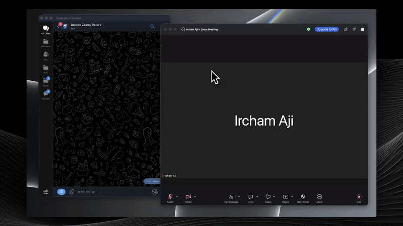
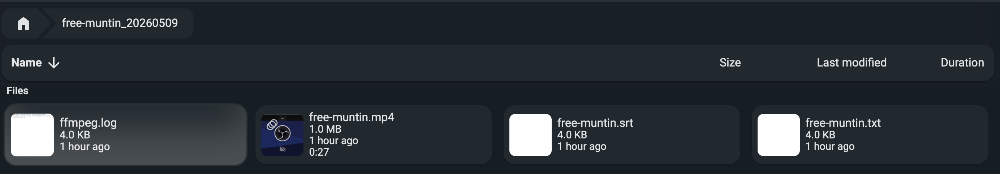

# Zoomy

A Telegram bot that records Zoom meetings by joining as a browser guest — no Zoom account or host access required.

## Demo

**Bot flow** (`/record` → schedule → join → stop)



**Recording output sample**



## How it works

Zoomy uses Playwright to join a Zoom web client session on a virtual display (Xvfb), then captures the screen and audio with FFmpeg.

```
/record <zoom_url>
  → Playwright joins zoom.us/wc/<id>/join on a dedicated Xvfb display
  → FFmpeg x11grab + PulseAudio null sink → libx264 MP4
  → Bot watches DOM for meeting-end signal
  → On end/stop: saves MP4 to /recordings, notifies Telegram
```

## Bot commands

### BotFather `/setcommands`

```
record - Start recording a Zoom meeting
stop - Stop the active recording
peek - Screenshot of the active meeting screen
schedule - View and cancel scheduled recordings
ongoing - Show active recordings
status - Active count + total across all users
```

### Command reference

| Command | Description |
|---------|-------------|
| `/record [zoom_url]` | Start recording a Zoom meeting |
| `/stop` | Stop the active recording |
| `/peek` | Screenshot of the active meeting screen |
| `/schedule` | View and cancel scheduled recordings |
| `/ongoing` | Show active recordings with duration, size, URL |
| `/status` | Your active count + total across all users |

### `/record` flow

1. **URL** — pass inline (`/record <url>`) or send after the prompt (100s timeout → cancelled)
2. **Bot name** — change the display name, or use the default (100s timeout → auto-selects default)
3. **Recording name** — type a label used as filename prefix, or skip (100s timeout → auto-name)
4. **Start now or schedule** — start immediately, or pick a future date/time in WIB (UTC+7)
5. Bot joins meeting muted + camera off → recording starts at 1080p

Multiple concurrent recordings are supported. Each session gets its own isolated display and audio sink. Per-user isolation: each authorized user manages only their own sessions.

## Stack

| Component | Role |
|-----------|------|
| Playwright (Chromium) | Joins Zoom web client, watches for meeting end |
| Xvfb (per session) | Virtual display — one per active recording |
| PulseAudio null sink (per session) | Virtual audio device for FFmpeg capture |
| FFmpeg x11grab + pulse | Screen + audio → MP4 (libx264, yuv420p, faststart) |
| python-telegram-bot v21 | Telegram bot interface |
| Filebrowser | Optional web UI to browse/download recordings |

## Project structure

```
zoomy/
├── bot/
│   ├── bot.py            # Telegram bot, command handlers, session flow
│   ├── recorder.py       # ZoomRecorder + DisplayPool (Playwright + FFmpeg)
│   ├── store.py          # SessionStore — per-user in-memory state
│   ├── entrypoint.sh     # Container startup (PulseAudio + Xvfb base)
│   ├── Dockerfile
│   └── requirements.txt
├── filebrowser/
│   └── settings.json
├── recordings/           # MP4 output (bind-mounted into container)
├── docker-compose.yml
└── .env.example
```

## Setup

### 1. Clone and configure

```bash
git clone <repo>
cd zoomy
cp .env.example .env
# Edit .env with your values
```

### 2. Environment variables (`.env`)

```env
TELEGRAM_TOKEN=your_bot_token
AUTHORIZED_USER_IDS=111111111,222222222   # comma-separated Telegram user IDs; leave empty to allow all
GUEST_NAME=Zoomy                          # default bot display name in meetings
RECORDINGS_DIR=/recordings
DEBUG=false                               # set true to save debug screenshots
```

Get your Telegram user ID from [@userinfobot](https://t.me/userinfobot).

### 3. Run

```bash
docker compose up -d --build
```

### 4. Access recordings

Filebrowser is included at port `7010`. On first run, check the container logs for the auto-generated password:

```bash
docker logs zoomy-files 2>&1 | grep -i password
```

You can also access recordings directly from the `recordings/` bind mount.

## Recording filename format

```
{name}_{YYYYMMDD}/          # named session   → folder + MP4 inside
{randomname}_{YYYYMMDD}/    # auto-named session
```

## Planned features

- **`/files`** — list recordings directly in Telegram with size and date; download small files without needing FileBrowser
- **Auto-cleanup** — automatically delete recordings older than a configurable number of days
- **Transcript summary** — after Whisper transcription, generate a summary via Ollama or an LLM API with a custom prompt
- **Transcript via Telegram** — send the `.txt` transcript file directly in chat after transcription
- **Transcript translation** — translate the transcript to another language after transcription
- **Edit scheduled recording** — reschedule a pending session without redoing the full setup flow

## Recording crop

Each session runs on a **1920×1200 virtual display** (Xvfb). The extra 120px of vertical space gives the browser chrome (address bar, tab bar) room to exist without eating into the meeting content.

After joining the meeting, the bot measures the browser chrome height once via JavaScript:

```js
window.outerHeight - window.innerHeight  // e.g. 90px
```

FFmpeg then starts with a `-vf crop=1920:{h}:0:{chrome_height}` filter baked in — applied live, frame-by-frame from the first second. The saved MP4 already has the chrome stripped; no post-processing pass is needed.

Example: chrome = 90px → `crop=1920:1110:0:90` → output is 1920×1110  
Example: chrome = 120px → `crop=1920:1080:0:120` → output is 1920×1080

Output is always ~1080p tall (exact height depends on the measured chrome), width stays 1920px.

## Notes

- Requires Docker with `shm_size: 2gb` (set in `docker-compose.yml`) for Chromium stability
- Bot joins meetings muted with camera off
- Meeting-end detection polls `document.body.innerText` every 3s — stops automatically when the host ends the meeting
- Stop notification includes duration, file size, and stop reason (host ended vs manually stopped)
- 1080p captures the full Xvfb display unscaled; 720p/360p apply `-vf scale=`
- Filebrowser requires a pre-created empty file at `filebrowser/filebrowser.db` (Docker will create a directory otherwise):
  ```bash
  mkdir -p filebrowser && touch filebrowser/filebrowser.db
  ```
